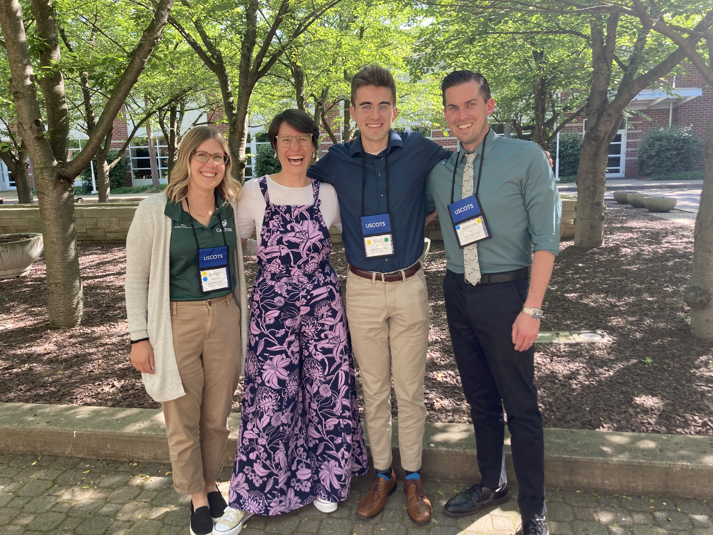
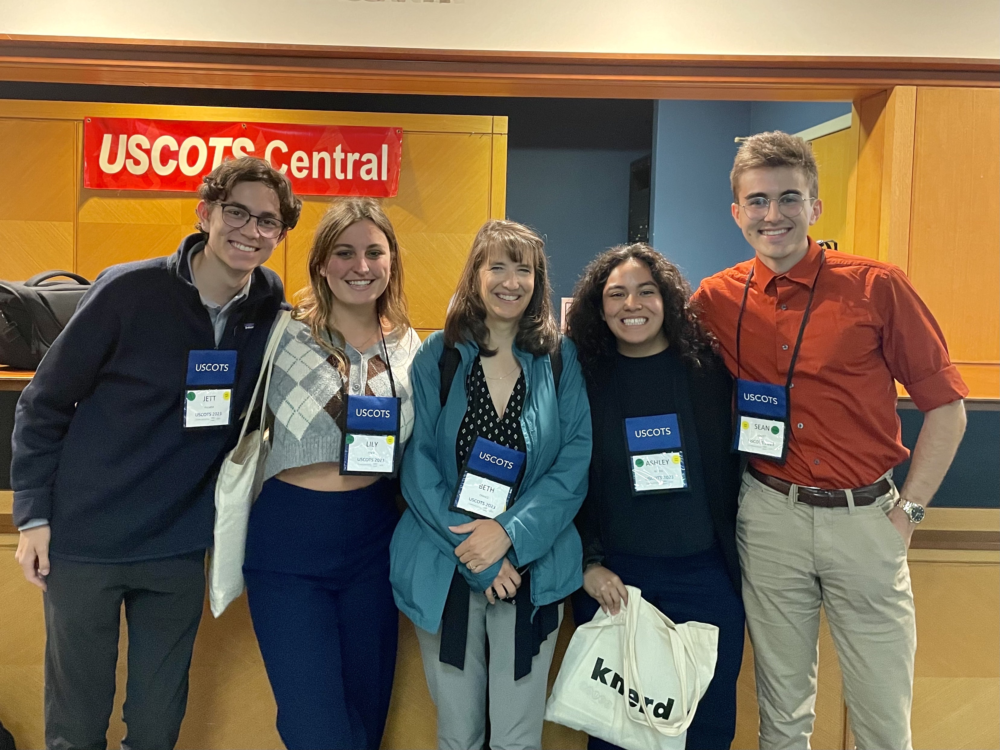
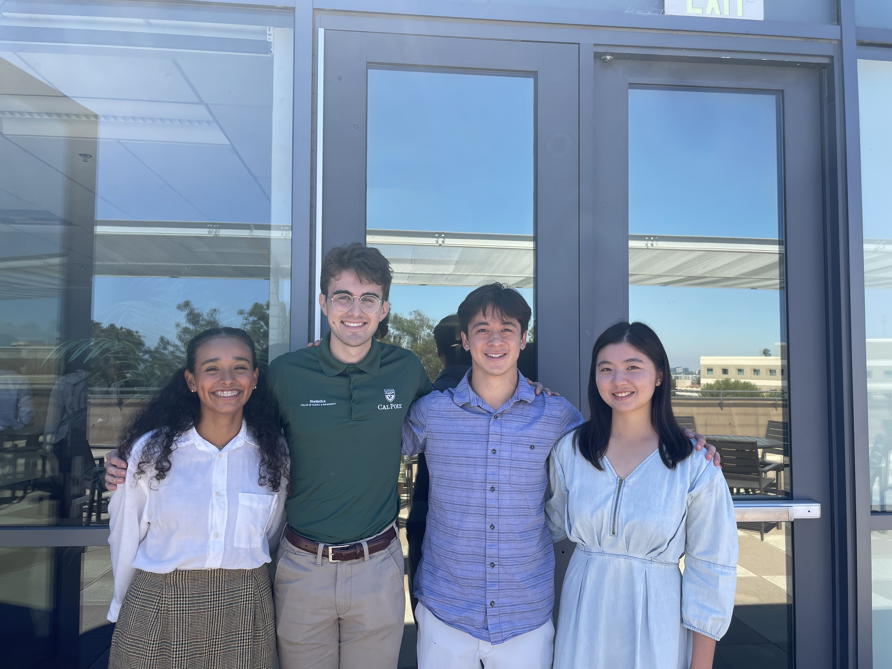
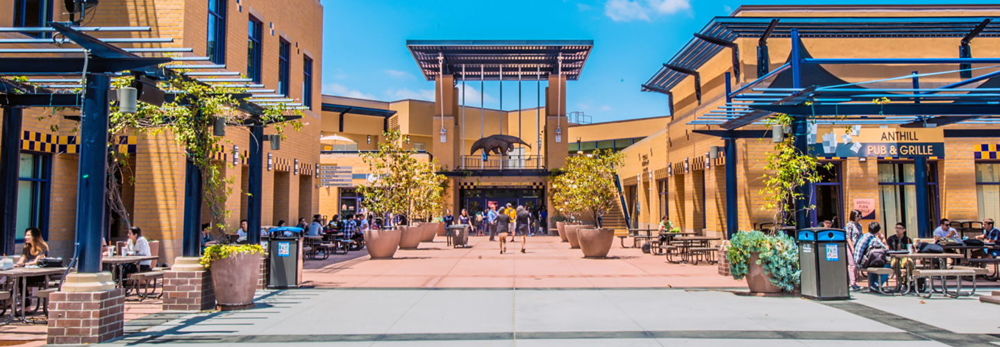
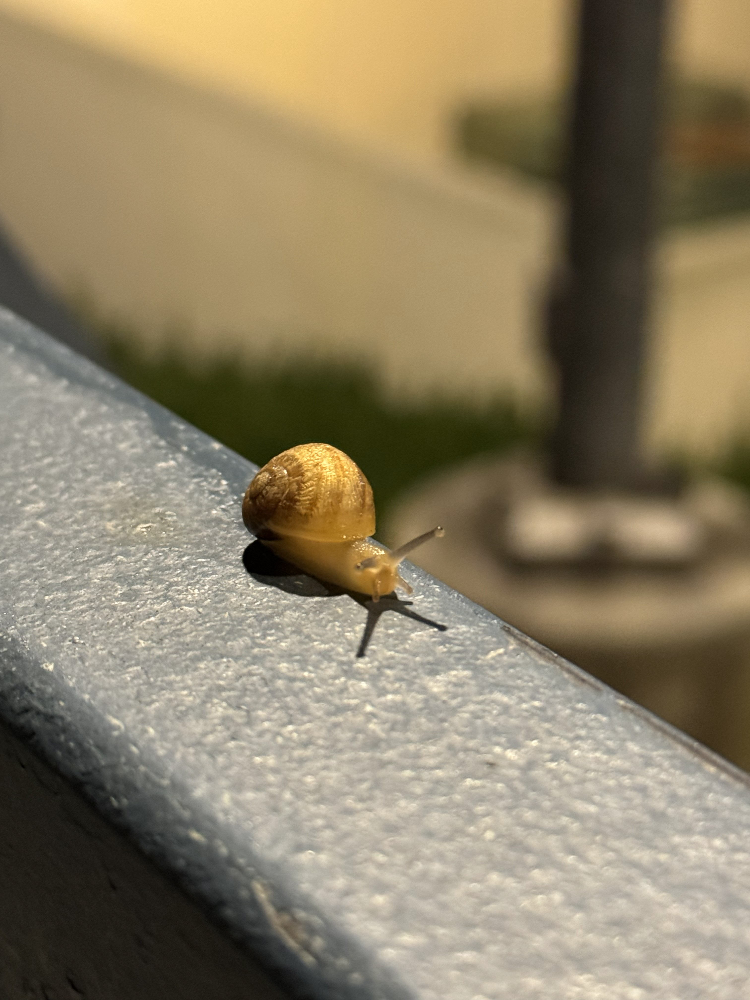
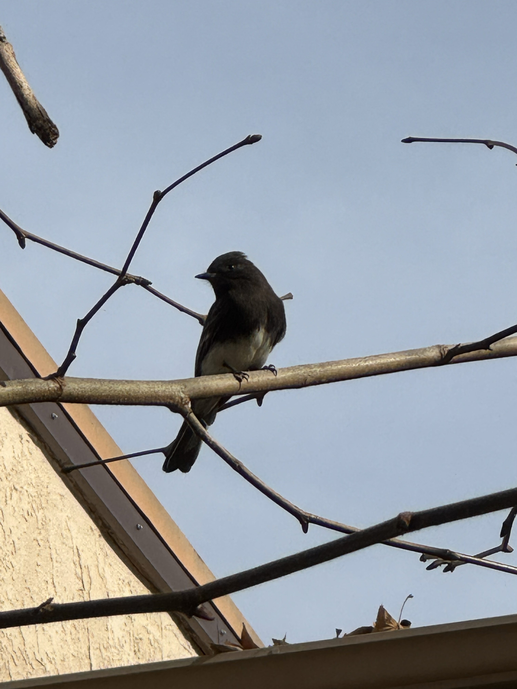
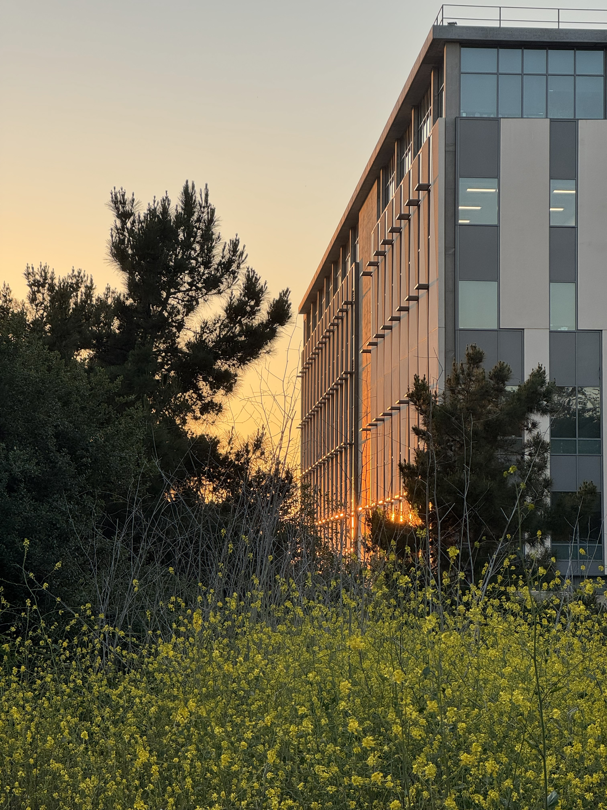
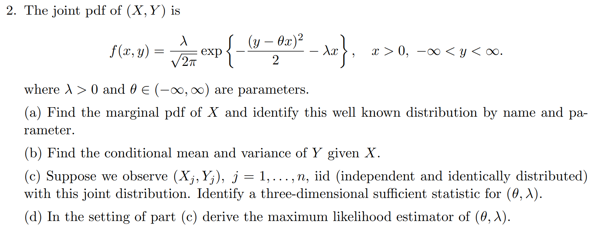

:::::: panel-tabset
## USCOTS 2023

### Background

In late May/early June of 2023, I attended [the United States Conference Of Teaching Statistics](https://www.causeweb.org/cause/uscots) in State College, Pennsylvania along with several peers and professors from Cal Poly. USCOTS is a conference that consists of a myriad of workshops, each presented by professors from universities across the United States (and a few from abroad!). There were also various presentations and opportunities to discuss with colleagues interested in similar areas relating to statistics and statistics education. **The theme of USCOTS 2023 was communicating with and about data.**

### Day One

On day one, I helped facilitate a workshop run by three Cal Poly professors: [Dr. Glanz](https://statistics.calpoly.edu/hunter-glanz), [Dr. Theobold](https://statistics.calpoly.edu/allison-theobold), and [Dr. Robinson](https://statistics.calpoly.edu/Emily-Robinson) by live testing questions from participants and assisting with participants' issues as they arose.

The workshop covered [Quarto](https://quarto.org), a versatile tool that allows users to create reproducible documents that integrate both code and text together. As a matter of fact, my website is built entirely in Quarto. We focused on using Quarto as a classroom resource - not only as a way for professors to create course materials such as presentations or websites, but also as a way for students to create reproducible documents for class assignments.

### Day Two

On day two, I attended two workshops, each of which focused on improving student learning outcomes using nontraditional methodologies.

#### Improving students' communication about data using online statistical games

This workshop provided a handful of games meant to teach statistical concepts through the lens of games that engage students in the learning process. We played two games.

- A crop-growing game that teaches students about random variation, blocking, and linear modelling.

- A racing game that teaches students about outliers, paired data, and confounding.

If you're interesting in exploring any of these games, please check out their resources here: <https://www.stat2games.sites.grinnell.edu>

#### Communicating progress in a statistics course through non-traditional grading

This workshop discussed non-traditional grading schemes that focus on qualitative grading schemes that de-emphasize numeric scores on particular assignments or exams, and instead focus on giving comprehensive feedback and allowing students to resubmit assignments multiple times. I think this grading scheme is particularly interesting, especially in the era of generative AI, as traditional grading methods may be more susceptible to abuse by students using services such as ChatGPT or Google Bard.

### Day Three / Four

Days Three and Four consisted of a mixture of a few types of events:

#### Keynote Presentations

In keynote presentations at USCOTS 2023, one speaker presented to the entirety of the conference attendees. These presentations focused heavily on the conference theme, providing a diverse set of perspectives on how statisticians and data scientists can enhance their communication skills with and about data. My favorite of the keynotes was [Larry Lesser's](https://larrylesser.com/welcome-to-statistics-education) presentation on 'edutainment', a teaching paradigm that treats students' entertainment, well-being, and engagement as paramount.

#### Breakout Sessions

Breakout sessions were short, fast-paced dialogues between presenters and attendees. During a given time slot, there were about 10 different breakout sessions one could attend based on their interests. Here are a few highlight sessions I attended:

- Data Science as a general education course
  - In this session hosted by Hunter Glanz, we conversed about data science as a terminal (not meant to lead into another course) general education course, where we discussed how to introduce topics about data science to a general audience. Given that data science is a complex and nuanced subject often taught after prerequisite courses, it is not obvious which topics deserve coverage in terminal course that may be taught to anyone, STEM or non-STEM. Dr. Glanz will be releasing a book by the name 'Data For All' (which I will contribute to during my graduate studies!) that is meant to do exactly this, so be on the lookout!
- What makes a compelling visualization?
  - This meeting hosted by Beth Chance and Emily Robinson discussed how to create informative and communicative visualizations, touching on both what *to* do as well as what *not* to do. This session sparked a great dialogue which gave me further insight on how to make compelling visuals at both an introductory and advanced level.

#### Poster Talks

During poster talks, dozens of participants presented their novel research on countless topics, ranging from phone apps meant to teach statistics to research on medieval-era data. In these talks, I was able to converse one-on-one with the various participants and ask (too many) questions about what they had done. My personal favorite of these posters taught students to compare traditional statistical modelling methodologies to some contemporary algorithmic techniques.

### Conclusion

This was the first conference I have ever attended. Although I would say I experienced a bit of information overload, I would not trade the experience for anything. I met many wonderful individuals and was welcomed with open arms to the statistics education community. I especially appreciated that although 99% (forgive my lackadaisical estimation) of attendees either had or were pursuing their PhDs, I was treated as an equal. Thank you to the organizers, presenters, sponsors, and attendees for providing me with a truly unforgettable experience.

## ISI-BUDS

### Background

[ISI-BUDS](https://www.stat.uci.edu/isi-buds) is a 6-week program in biostatistics and data science hosted by UC Irvine. It is part of a larger set of 10 programs across the United States sponsored by both the [National Institute of Allergy and Infectious Diseases](https://www.niaid.nih.gov) and the [National Heart, Lung, and Blood Institute](https://www.nhlbi.nih.gov). I attended this program in summer of 2023, along with 14 other undergraduate students from all over the country.

### Educational Content

The first three weeks of the program were dedicated to preparing us for the eventual project work through a combination of lectures and labs on a wide array of concepts. Much of the content was familiar to me, but I learned some new highly valuable skills that I wasn't anticipating. A non-exhaustive list of the content we covered is as follows:

- Data Collection
  - Interplay between science and statistics
  - Study designs
- Coding
  - R & Tidyverse
    - Reproducibility
    - Data Manipulation
    - Data Visualization
  - Monte Carlo
    - Integration
    - Methods for Inference
    - Importance Sampling
- Theory
  - Probability Theory
  - Statistical distributions
- Modeling
  - Generalized Linear Models
  - Mixed Effects Models
  - Covariates
    - Adjustments
    - Interpretations
    - Mathematical Implications

### Alzheimer's Disease Project

The last three weeks of the program consisted of applying the skills covered in the prior weeks to a research project in the area of biostatistics. Each student was assigned to one of four projects based on their interest in each particular research area. I was placed on a project with three other students that investigated the research attitudes of populations of particular interest to Alzheimer's Disease research.

Throughout this project, we learned a new paradigm for doing research that challenged our preconceived ideas of how research is done. This paradigm focuses much more on the work that takes place prior to modeling, placing a much larger emphasis on formulating the model specification in accordance with the research question of interest. With an awareness of [the reproducibility crisis](https://en.wikipedia.org/wiki/Replication_crisis), our mentors ensured that we were carefully specifying which decisions were made before and after seeing the data and fitting models to ensure that our analyses are clearly specified.

Our primary mentor for our research project was Dan Gillen, the head of the Statistics department at UC Irvine. We also worked with Josh Grill, Ira Lott, and Eric Doran for expertise in the Alzheimer's Disease and Down Syndrome communities. I cannot begin to stress how impactful Dan Gillen's mentorship was on my statistical thinking over the course of the program. Although I have a solid foundation in the principles of statistics, Dr. Gillen challenged me to think about things in a new light and provided invaluable guidance throughout our research project. Also, a special thank-you to Thuy Lu, our PhD student advisor, who assisted us at every turn and helped streamline the learning and research process.

Our research project culminated in a presentation and research paper. The presentation allowed us to communicate our findings and practice our statistical communication skills with active members of the statistics community, which is a unique audience I don't often have the chance to engage with. All of the presentations given by the other groups were insightful and meaningful, ranging from research on colorectal cancer to managing HIV for women in India.

[Our research paper was published in Alzheimer's & Dementia: Translational Research & Clinical Interventions!](https://doi.org/10.1002/trc2.12478)

### Outside the classroom

In addition to the rigorous and rewarding academic program we were participating in, there was ample time to socialize and connect with the other undergraduate students attending the program. ISI-BUDS provided each student with a free ARC (Anteater Recreation Center) membership that granted access to all facilities. Over the course of the program, we played countless sports including basketball, volleyball, tennis, spikeball, and swimming.

The coordinators of ISI-BUDS were also generous enough to plan a few expeditions for us on a few of the weekends, where we went kayaking and whale watching! These events brought our cohort closer together and bolstered our collaboration with one another throughout the program.

### Conclusion

Overall, ISI-BUDS was a fantastic program that further developed my technical skills while also introducing me to a community of like-minded statisticians that I hope to remain in contact with moving forward. Thank you to the directors of the program, the lecturers and mentors that taught many valuable lessons, and the other undergraduate students that made the experience unforgettable.

## PhD - Year 1

### Fall

My journey at UC Irvine began in September 2024, driven by a desire to formalize my understanding of statistics and push the boundaries of my mathematical knowledge. I started the term in a sprint, working closely with my advisor to submit an NSF Graduate Research Fellowship Program (GRFP) application, proposing a survival analysis project focused on Alzheimer’s Disease. While we weren't ultimately funded, the process was invaluable. It forced me to dive deep into the literature and sharpened my ability to articulate complex research goals.

::: img-float-left

:::

In the classroom, I navigated two parallel sequences: one rooted in mathematical theory and the other in applied modeling.

**The Theory Sequence:** A rigorous review of probability, asymptotic theory, and linear modelig and quadratic forms

**The Applied Sequence:** An exploration of the basic linear model, an expansion to generalized linear models, and an introduction into generalized estimating equations.

In particular, the theory class reviewed probability, common probability distributions, univariate and bivariate variable transformations, moment-generating functions, weak convergence, the law of total expectation/variance, order statistics, and Poisson processes. The applied class, on the other hand, detailed the basic linear model through matrix representation, decomposition of the variance, individual t-tests, full and partial F-tests, interpretations of parameters, and model selection.

Beyond my own studies, I stepped into the role of a Teaching Assistant (TA) for the first time in an introductory statistics course. As a long-time tutor, this was my bread and butter, but it was uniquely rewarding to facilitate those first "aha!" moments for the students.

By the end of the term, I had overcome great setbacks (that first theory midterm didn't go so well!), but I knew that the most challenging times were still ahead, especially with the qualifying exams looming in June.

### Winter

Returning to Irvine after the holidays, I felt a revived impetus to understand the upcoming material. The stakes were higher: my advisor was teaching the theory class, and I knew this term would be a make-or-break moment for my academic confidence.

::: img-float-right

:::

The curriculum intensified in Winter as we expanded upon ideas from Fall, introducing more types of convergence and related theorems, asymptotic distributions, point estimation via Method of Moments Estimators (MMEs) and Maximum Likelihood Estimators (MLEs), Uniformly Minimum-Variance Unbiased Estimators (UMVUEs), and hypothesis testing. In the applied track, we generalized concepts from the basic linear models class, introducing the theory and application of Generalized Linear Models (GLMs) and survival analysis models. I also added a computational statistics class, teaching me about optimal matrix decomposition methods, importance sampling, Markov Chain Monte Carlo (MCMC), and hidden Markov models.

Seeing these mathematical foundations applied to complex statistical problems helped me understand not just how these methods work, but why they were developed. As I delve deeper into the history of statistics, my appreciation for the underlying assumptions of these methodologies continues to grow.

### Spring

By April, the focus shifted entirely toward the finish line. Five friends from my cohort and I designed a three-month "divide-and-conquer" study plan. Every week, we collaboratively tackled a previous year’s qualifying exam. This allowed us to cover a much wider breadth of problems than any of us could have managed alone, turning the daunting task of review into a manageable, communal effort.

::: img-float-left

:::

Even with the exams approaching, my coursework remained steady. I took a fascinating course on infectious diseases, using SIR models, Markov chains, Ordinary Differential Equation (ODE) models, branching processes, and importance sampling. Our theory class returned to linear models, where we worked heavily with proofs related to estimability, Best Linear Unbiased Estimators (BLUE), Gauss-Markov theory, Iteratively Reweighted Least Squares (IRLS), quadratic forms, and asymptotic distributions. The applied class extended and formalized ideas from generalized linear models to correlated data through the usage of Generalized Linear Mixed Models (GLMMs) and Generalized Estimating Equations (GEEs), with a heavy emphasis on the theory.

Admittedly, this term was a struggle. Between the complexity of the material and the looming anxiety of the qualifying exams, I found the concepts harder to grasp than the previous months. It was a humbling reminder that learning is rarely a linear path.

### Qualifying Exams

The UC Irvine statistics qualifying exams are a two-part assessment: a Theory Exam & a Data Analysis project. Given my applied background from my time at Cal Poly, I had split confidence; I felt prepared for the data, for wary of the theory. I was hoping, but not expecting, to pass both.

**The Theory Exam:** Mid-way through the three-hour exam session, I hit a wall of panic. I drew a complete blank on a foundational question I *knew* I should be able to answer. I was forced to pivot to a problem I felt less certain about. However, in the final twenty minutes, I found several breakthroughs. After submitting the theory examination, we were given a project specification for the data analysis.

**The Data Analysis:** We were given a week to analyze a dataset regarding wearable device (e.g. Apple Watch) fitness interventions. My analysis used several methods, including a Poisson GLM, a GEE, a cross-validated LASSO regression, and a LME. My first submission was mostly sufficient, but it missed a few scientific nuances. After receiving specific feedback on sections of my report, I addressed the limited issues and resubmitted.

After the great deal of effort, I was able to earn a pass on both the theory and data analysis. These exams were more than just a hurdle for me; they were a bridge. They allowed me to take a year's worth of abstract theory and apply it to demonstrate my understanding of the basis of statistics. More importantly, they marked an inflection point in my career. I am no longer just a student absorbing information; I am transitioning into a researcher capable of investigating new ideas. The first year went by in a blink, just four more to go!

## PhD - Year 2

### Fall

The second year of my program passed even more quickly than the first, a microcosm of how the time accelerates the longer you're immersed in something. Unlike my first year, this one consisted of my transition from pure coursework toward independent research, interdisciplinary collaboration, and stepping up as an educator. 

::: img-float-left

:::

I spent Autumn solidifying my foundations in Stochastic Processes and seeing them play out in real-world applications in a clinical trials class. I also worked as a TA in a 400-student introductory statistics course, which was a great avenue to practice teaching. My office hours sessions were often full, with students working and discussing problems together; it was a lot of fun.

### Winter

The changing of the seasons mirrored my own transition into my first appointment as a graduate student researcher. I joined a project investigating challenges in cognitive testing among populations at high risk for Alzheimer's Disease. 

::: img-float-right

:::

My applied work was matched with rigorous coursework in Measure Theory, Bayesian Statistics, and Spatial Statistics. I also ran my first half marathon during this period, in Carlsbad. Physical fitness became an important outlet for stress relief. 

### Spring

After a brief break, I returned to my research and final sequence of classes before I finishing courses for good. Working directly with domain experts in epidemiology and neurology made for seamless application of statistical models to meaningful research questions. 

In my final term, I took Decision Theory and Advanced Bayesian Statistics to round out my theoretical foundations in the classroom. From now on, my foundations will continue to expand through my methods research — a new way of learning I look forward to exploring. 

I also took a Statistical consulting class where I partnered with postdoctoral researcher on addiction research analyzing rodent behavioral changes under different psychedelic compounds. The analysis posed unique challenges around experimental structure, behavioral data extraction, and modeling, which made it a rewarding project. 

::: img-float-left

:::

### Summer

Over the summer, I embraced my newfound freedom from classes to dive into mentorship, research, and teaching all at once. I served as a mentor for the ISI-BUDS program, the same program I participated in as an undergraduate a few years ago. It meant navigating the combined role of mentor, researcher, and collaborator alongside an expert neuropsychologist and psychiatry researcher.  

Our project analyzes cognitive decline in individuals with Down Syndrome in relation to neuropsychiatric symptoms. 

Stepping into the mentor role, directing the students in my group as they worked through their own researcher, felt both unusual and completely natural. I loved the chance to teach others about research through this program, since it's the same experience that got my hooked on research and led me to grad school in the first place. 

As I continue transitioning from student to researcher and educator, I hope to carry the same open-minded curiosity forward. With funding from a T32 Training Grant in the Neurobiology of Aging and Alzheimer's Disease, my plan for the  year ahead is to draft my first lead-author paper, advance to candidacy, and attend several conferences to share the research I've been working on.

::::::
