## 🌍 Tanzania (2025)

------------------------------------------------------------------------

::: horizontal-scroll
<a href="#" class="lightbox-trigger" data-img-src="photos/lion.jpg">{width="200" loading="lazy"}</a><a href="#" class="lightbox-trigger" data-img-src="photos/lioness.jpg">{width="200" loading="lazy"}</a><a href="#" class="lightbox-trigger" data-img-src="photos/elephant.jpg">{width="200" loading="lazy"}</a><a href="#" class="lightbox-trigger" data-img-src="photos/wildebeest.jpg">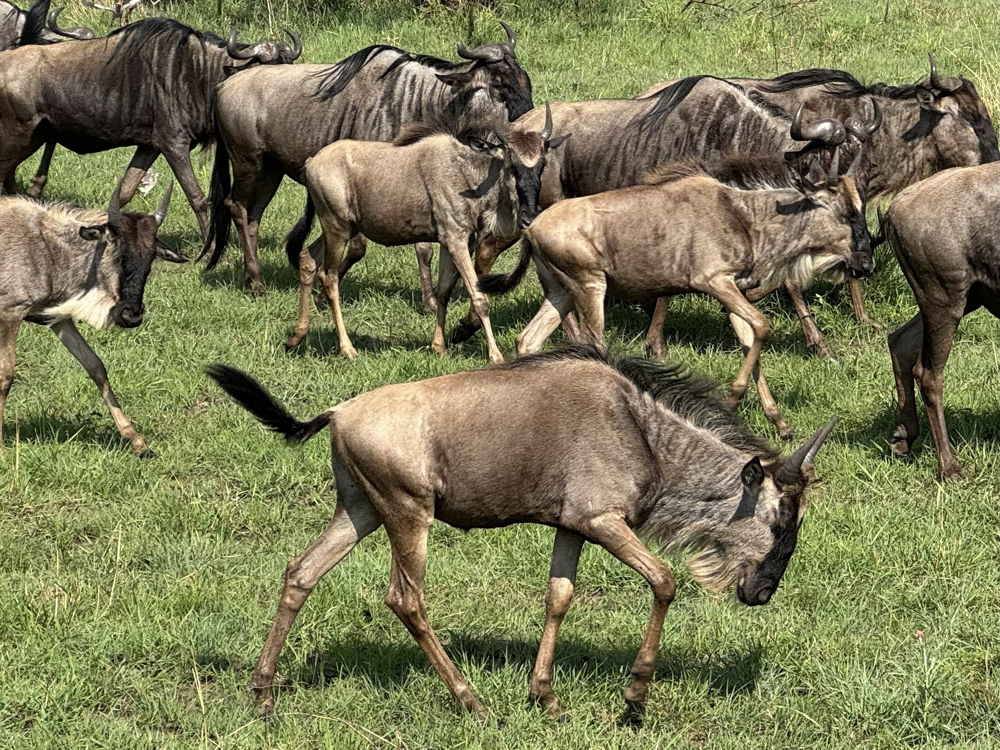{width="200" loading="lazy"}</a><a href="#" class="lightbox-trigger" data-img-src="photos/zebra_sunset.jpg">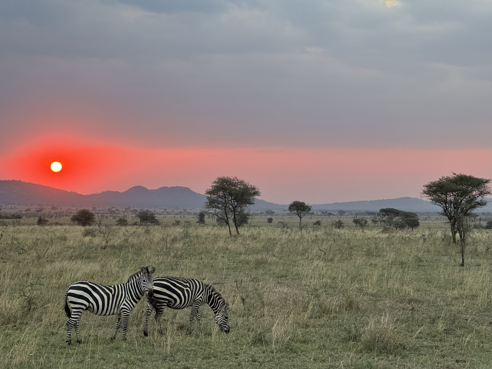{width="200" loading="lazy"}</a><a href="#" class="lightbox-trigger" data-img-src="photos/bluebird.jpg">{width="200" loading="lazy"}</a><a href="#" class="lightbox-trigger" data-img-src="photos/ostrich.jpg">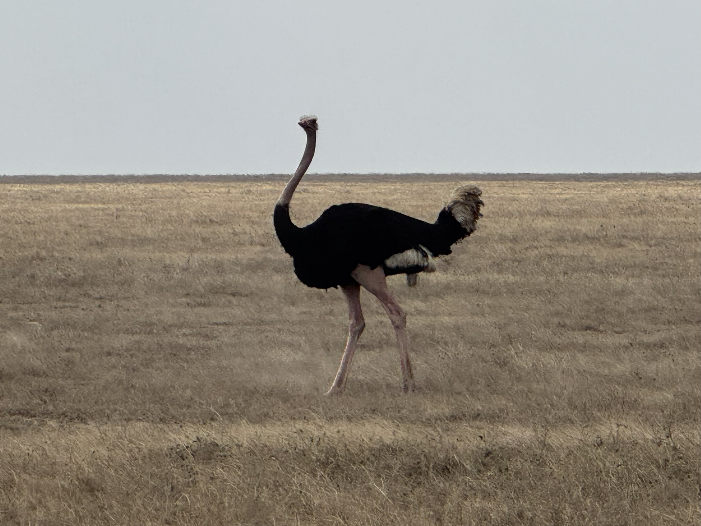{width="200" loading="lazy"}</a><a href="#" class="lightbox-trigger" data-img-src="photos/hippos.jpg">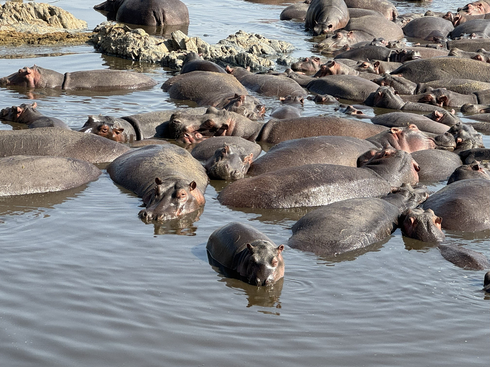{width="200" loading="lazy"}</a><a href="#" class="lightbox-trigger" data-img-src="photos/monkey.jpg">{width="200" loading="lazy"}</a><a href="#" class="lightbox-trigger" data-img-src="photos/lobelia.jpg">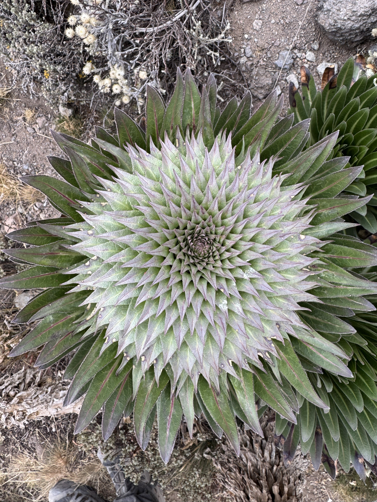{width="200" loading="lazy"}</a><a href="#" class="lightbox-trigger" data-img-src="photos/giraffes.jpg">{width="200" loading="lazy"}</a><a href="#" class="lightbox-trigger" data-img-src="photos/wilde_cross.jpg">{width="200" loading="lazy"}</a><a href="#" class="lightbox-trigger" data-img-src="photos/bird.jpg">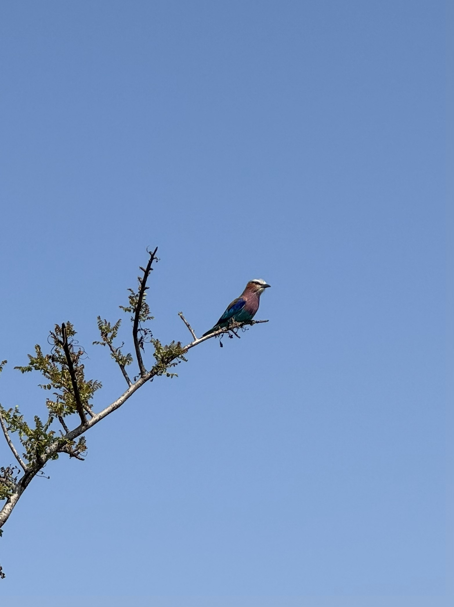{width="200" loading="lazy"}</a><a href="#" class="lightbox-trigger" data-img-src="photos/blue_chicken.jpg">{width="200" loading="lazy"}</a><a href="#" class="lightbox-trigger" data-img-src="photos/butterfly.jpg">{width="200" loading="lazy"}</a><a href="#" class="lightbox-trigger" data-img-src="photos/hyena.jpg">{width="200" loading="lazy"}</a><a href="#" class="lightbox-trigger" data-img-src="photos/senecio.jpg">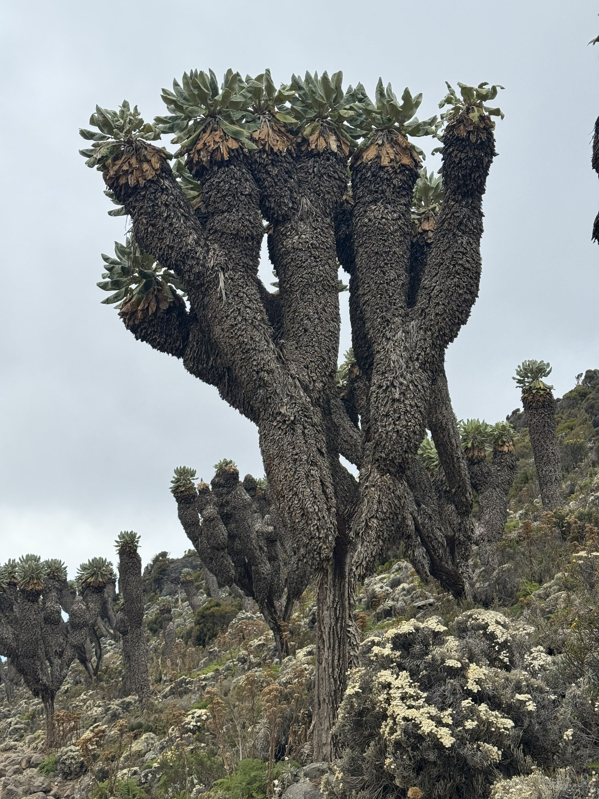{width="200" loading="lazy"}</a><a href="#" class="lightbox-trigger" data-img-src="photos/skull.jpg">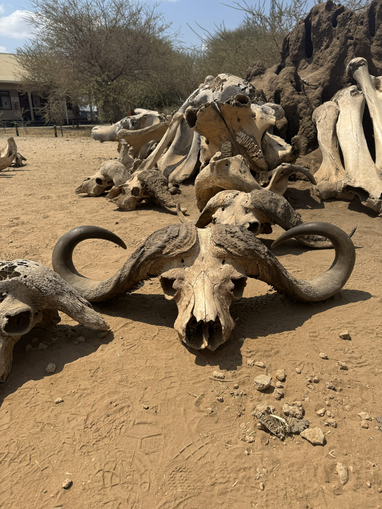{width="200" loading="lazy"}</a><a href="#" class="lightbox-trigger" data-img-src="photos/yellowbird.jpg">{width="200" loading="lazy"}</a><a href="#" class="lightbox-trigger" data-img-src="photos/zebra.jpg">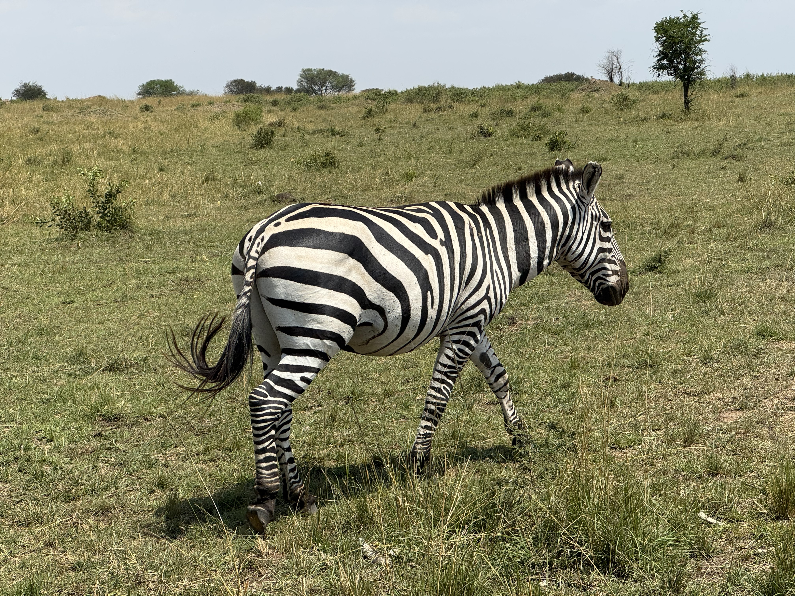{width="200" loading="lazy"}</a>
:::

::: horizontal-scroll
<a href="#" class="lightbox-trigger" data-img-src="photos/welcome.jpg">{width="200" loading="lazy"}</a><a href="#" class="lightbox-trigger" data-img-src="photos/baranco_terrain.jpg">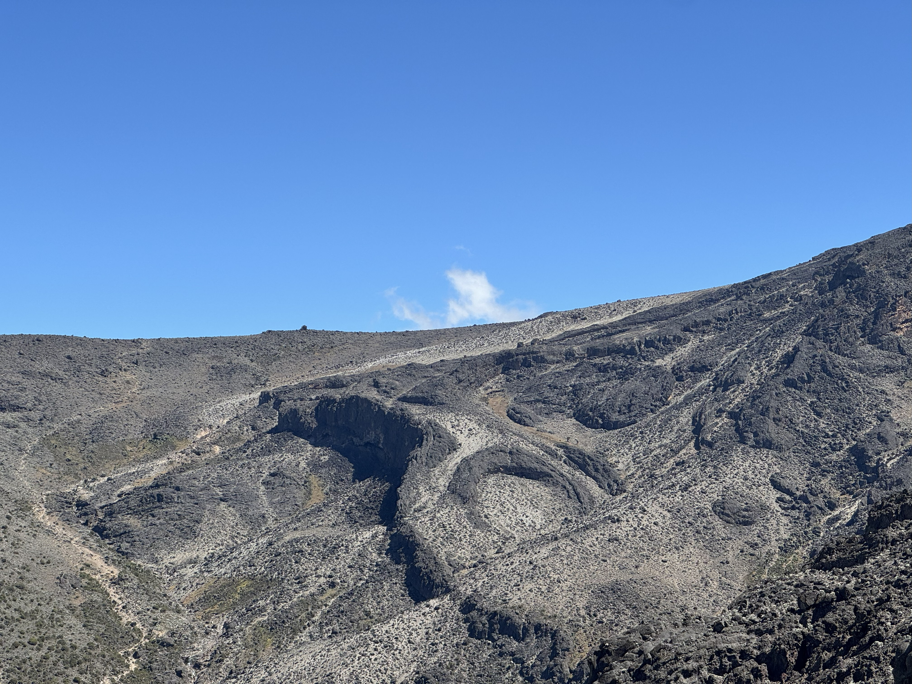{width="200" loading="lazy"}</a><a href="#" class="lightbox-trigger" data-img-src="photos/kili_shadow.jpg">{width="200" loading="lazy"}</a><a href="#" class="lightbox-trigger" data-img-src="photos/glacier_sunrise.jpg">{width="200" loading="lazy"}</a><a href="#" class="lightbox-trigger" data-img-src="photos/kili_landscape.jpg">{width="200" loading="lazy"}</a><a href="#" class="lightbox-trigger" data-img-src="photos/basecamp.jpg">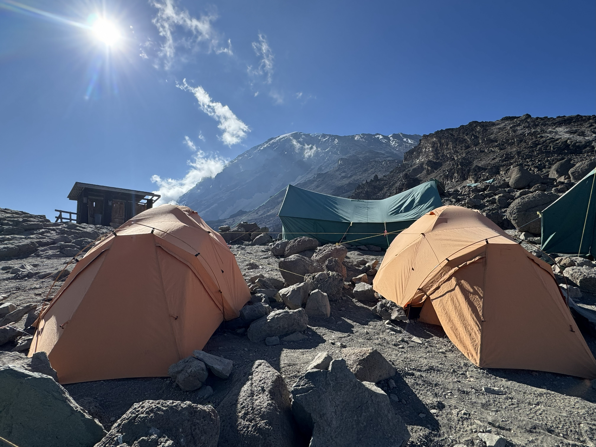{width="200" loading="lazy"}</a><a href="#" class="lightbox-trigger" data-img-src="photos/frosted.jpg">{width="200" loading="lazy"}</a><a href="#" class="lightbox-trigger" data-img-src="photos/mountain_night.jpg">{width="200" loading="lazy"}</a><a href="#" class="lightbox-trigger" data-img-src="photos/night_vertical.jpg">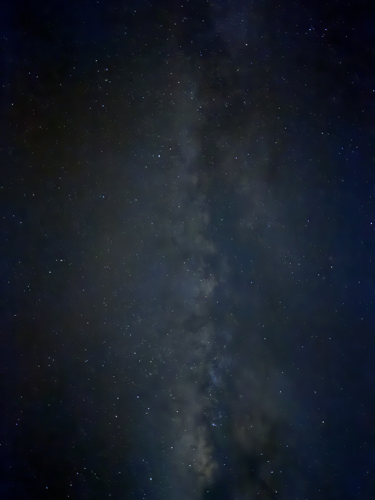{width="200" loading="lazy"}</a><a href="#" class="lightbox-trigger" data-img-src="photos/river.jpg">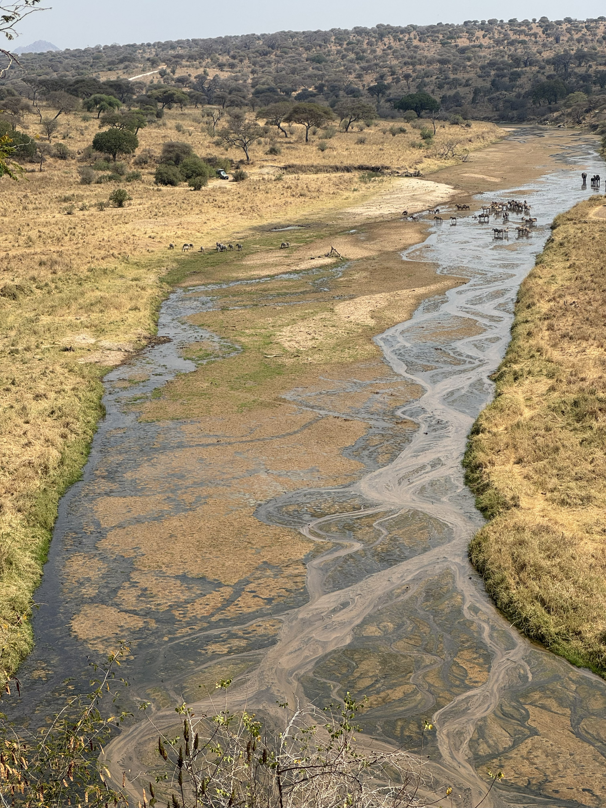{width="200" loading="lazy"}</a><a href="#" class="lightbox-trigger" data-img-src="photos/summit_shadow.jpg">{width="200" loading="lazy"}</a><a href="#" class="lightbox-trigger" data-img-src="photos/mawenzi.jpg">{width="200" loading="lazy"}</a><a href="#" class="lightbox-trigger" data-img-src="photos/lantern.jpg">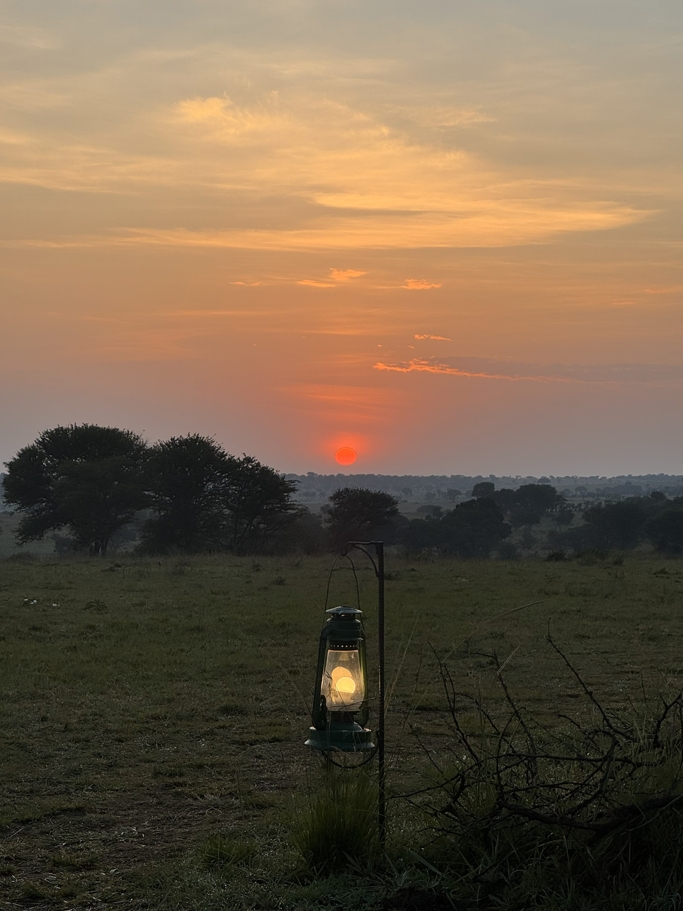{width="200" loading="lazy"}</a><a href="#" class="lightbox-trigger" data-img-src="photos/kenya_mountain.jpg">{width="200" loading="lazy"}</a><a href="#" class="lightbox-trigger" data-img-src="photos/bathroom.jpg">{width="200" loading="lazy"}</a><a href="#" class="lightbox-trigger" data-img-src="photos/forest_night.jpg">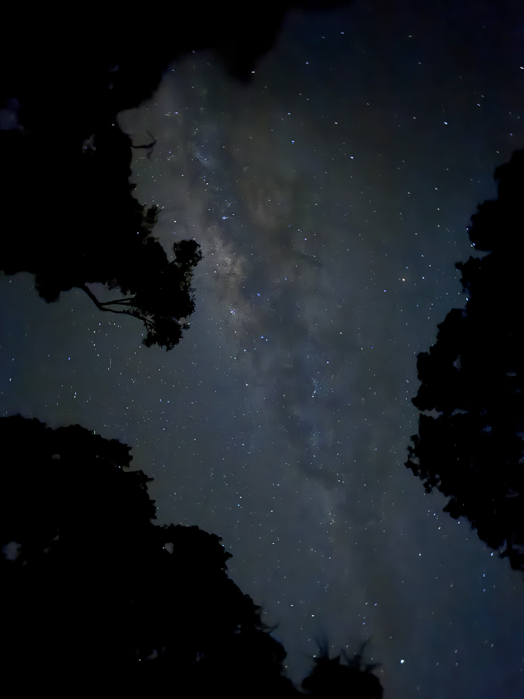{width="200" loading="lazy"}</a>
:::

::: {#lightbox-overlay}
```         

```
:::

------------------------------------------------------------------------

```{=html}
<script>
document.addEventListener('DOMContentLoaded', () => {
    // --- 1. HORIZONTAL SCROLL FUNCTIONALITY ---
    const scrollers = document.querySelectorAll('.horizontal-scroll');

    scrollers.forEach(scroller => {
        scroller.addEventListener('wheel', (event) => {
            if (event.deltaY !== 0) {
                event.preventDefault(); 
                scroller.scrollLeft += event.deltaY;
            }
        });
    });

    // --- 2. CUSTOM LIGHTBOX (OVERLAY) FUNCTIONALITY ---
    
    // Look up elements once the DOM is loaded
    const overlay = document.getElementById('lightbox-overlay');
    const modalImage = document.getElementById('lightbox-modal');
    const triggers = document.querySelectorAll('.lightbox-trigger');

    // CRUCIAL FIX: Only proceed with lightbox listeners if the elements were found
    if (overlay && modalImage) {
        
        // Open Lightbox
        triggers.forEach(trigger => {
            trigger.addEventListener('click', (event) => {
                event.preventDefault(); 
                const imgSrc = trigger.getAttribute('data-img-src');
                
                modalImage.src = imgSrc; 
                overlay.style.display = 'flex'; 
            });
        });

        // Close Lightbox (when clicking on the overlay background)
        overlay.addEventListener('click', (event) => {
            if (event.target === overlay) {
                overlay.style.display = 'none';
                modalImage.src = ''; 
            }
        });

        // Close Lightbox (when pressing ESC key)
        document.addEventListener('keydown', (event) => {
            if (event.key === 'Escape') {
                overlay.style.display = 'none';
                modalImage.src = '';
            }
        });
    }
});
</script>
```
